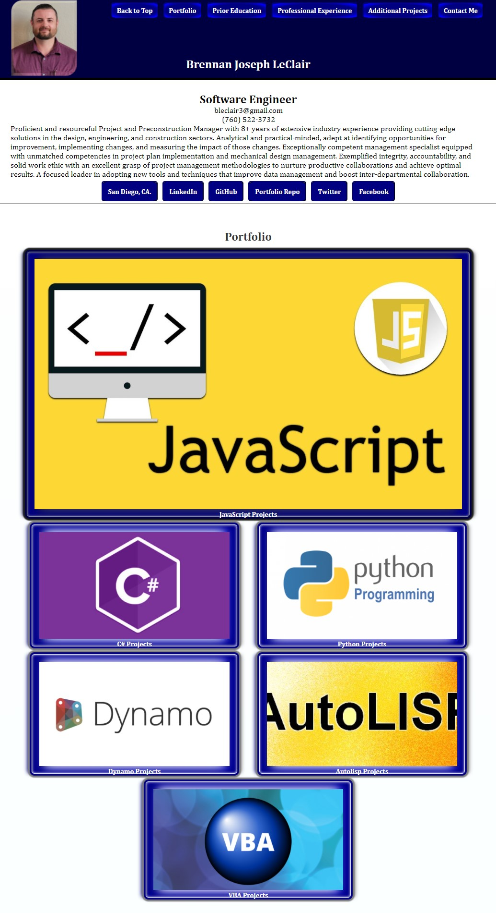
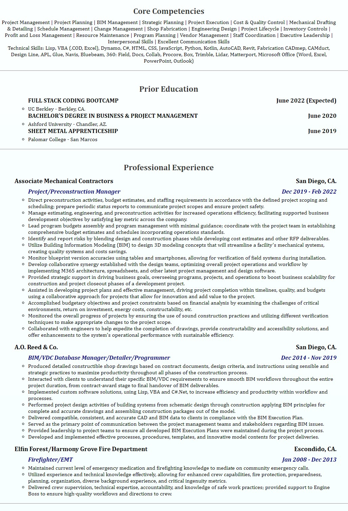
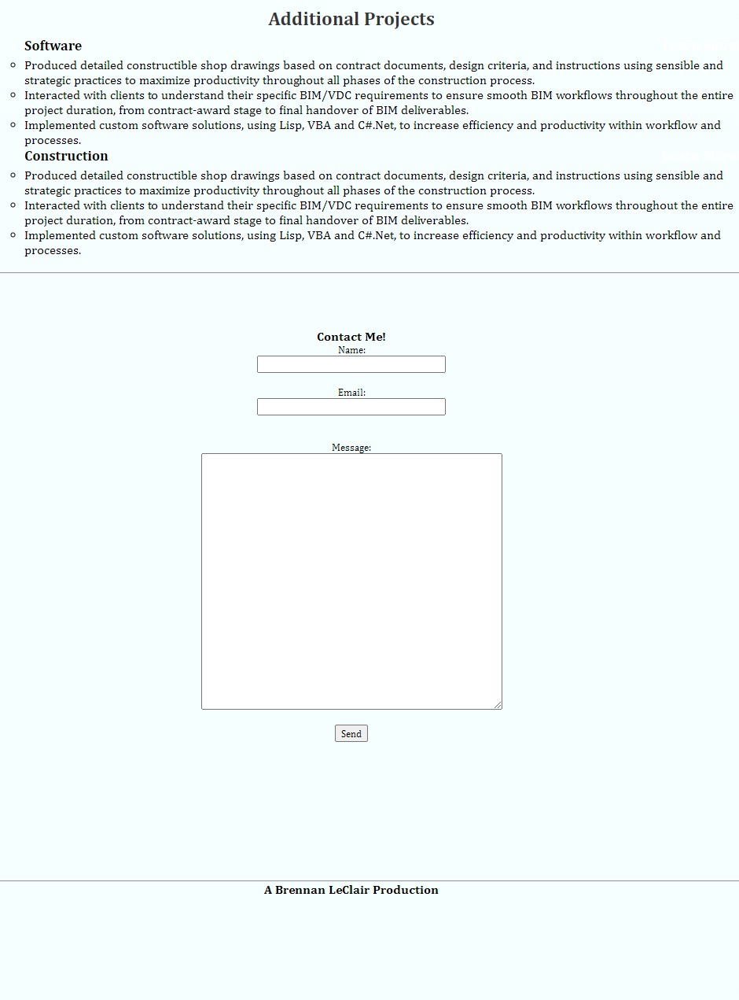

# CSS-Snippets

CSS Snippet Cheatsheet

## Description 

Herein lies my professional accomplishments to date.  This site includes an introduction followed by my portfolio and my history.  

## Table of Contents (Optional)

* [Installation](#installation)
* [Usage](#usage)
* [Credits](#credits)
* [License](#license)

### Installation

Visit: https://blec333.github.io/My-Portfolio/ to review my deployed portfolio.

There you will find a number of links to various projects.  Some of these projects are web hosted examples of capability, while others are a testament to past work and require the installation of software to review functionally.  To review samples of my HTML, CSS or Javasctipt acumen please select the appropriate link on my portfolio.  To review samples of my C#, Python, Dynamo, VBA or Lisp; you will need to have installed the Autodesk AEC suite.  Please see usage section below for further details.

## Usage 

HTML: Please visit the deployed links and associated source code to review semantic structure.

CSS: Please review dynamic style strategies implemented on all provided HTML projects.

Javascript: Please review various examples of deployed functional implementations.

C#: Requires installation of Autodesk AEC Suite including Fabrication CADmep software to evaluate functionality.  If able and so desired, please appload into Fabrication CADmep and test the provided custom commands.
* Written using .NET Framework 4.6.5

Python: Requires installation of Autodesk AEC Suite - Revit and Dynamo.  Load Python nodes into Dynamo.

Dynamo: Requires installation of Autodesk AEC Suite - Revit and Dynamo.  Load Dynamo script into Revit.

Lisp: Requires installation of Autodesk AEC Suite including Fabrication CADmep software to evaluate functionality.
* Provided resource files must be loaded into the default installation directory (replacing default files); this ensures data is properly exposed to the application for parsing and use in functions.

VBA: Two deployment softwares;
* 1st requires installation of Autodesk AEC Suite including Fabrication CADmep software to evaluate functionality.
* 2nd requires only Excel to open and review.

## Final Product

Deployed Application
https://blec333.github.io/My-Portfolio/

Github Repository
https://github.com/Blec333/My-Portfolio

### Acknowledgements

©Brennan LeClair
